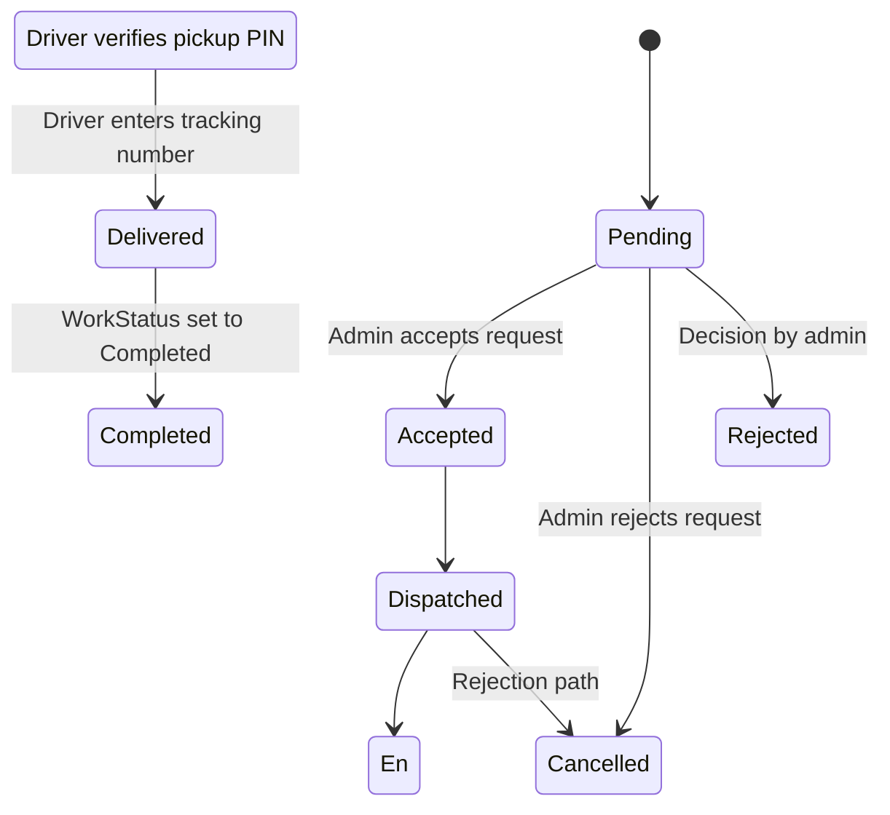

# LOGISTICS_SYSTEM_ATOMIC_AUDIT

> Analysis only. No project files were modified.
>
> Repository audited: KeystoneLogistics.Web-main (C# ASP.NET MVC / Entity Framework / SQL Server)
>
> Scope: forensic, operational, logistics-function audit. This report is grounded in the repository as it exists, not in a hypothetical intended architecture.

## PART 1 — COMPLETE CODEBASE INVENTORY

### 1.1 Executive finding
This repository is a small logistics management prototype, not a realistic operational logistics platform. The main domain object is a single `Load` entity that acts as a simplified shipment/job record. It includes pickup and dropoff text fields, a status string, a driver and vehicle reference, and a passcode. The business logic is mostly status-driven and uses hard-coded workflow steps, not a full operational model.

### 1.2 Solution and project inventory
- Solution file: `KeystoneLogistics.sln`
- Project file: `KeystoneLogistics.csproj`
- User project file: `KeystoneLogistics.csproj.user`
- ASP.NET configuration: `Web.config`, `Web.Debug.config`, `Web.Release.config`
- Global app startup: `Global.asax`, `Global.asax.cs`
- Database schema bootstrap: `KeystoneDB_Setup.sql`
- Model metadata: `Models/Metadata/*`
- Database context: `Models/KeystoneLogisticsDB.Context.cs`

### 1.3 Controllers
| Component | File | What it does | Business purpose | Evidence of realism |
|---|---|---|---|---|
| AccountController | `Controllers/AccountController.cs` | Login, logout, password reset | Identity and session management | Basic; no role-specific permission model beyond strings in session |
| CustomersController | `Controllers/CustomersController.cs` | CRUD for customer records and customer-specific loads | Contact/profile management | Basic CRUD only; no B2B account model |
| DriversController | `Controllers/DriversController.cs` | CRUD for drivers | Driver registry | Basic profile management only |
| HomeController | `Controllers/HomeController.cs` | Dashboard metrics, reviews, contact form | Admin visibility and marketing | Dashboard is superficial and not operationally deep |
| LoadsController | `Controllers/LoadsController.cs` | Shipment creation, admin accept/reject, pickup verification, delivery confirmation, POD upload | Core logistics flow | Operational but extremely simplified |
| AuditLogsController | `Controllers/AuditLogsController.cs` | Access to audit log data | Logging review | Not central to operations |

### 1.4 Key models/entities
| Entity | File | Purpose | Important fields | Operational realism |
|---|---|---|---|---|
| `Load` | `Models/Load.cs` | Main shipment/job record | `LoadId`, `TrackingNumber`, `CustomerId`, `DriverId`, `PickupLocation`, `DropoffLocation`, `CargoDescription`, `Status`, `WorkStatus`, `CollectionPasscode`, `CurrentLocation`, `IsCollected`, `AssignedVehicleId` | This is the central object; it collapses shipment, route, and job into one record |
| `Customer` | `Models/Customer.cs` | Customer contact/company record | `CustomerId`, `CompanyName`, `ContactPerson`, `Email`, `Phone` | Basic, no B2B account structure |
| `Driver` | `Models/Driver.cs` | Driver record | `DriverId`, `FullName`, `Phone`, `VehicleRegistration`, `IsAvailable` | Not a real driver operations model |
| `Vehicle` | `Models/Vehicle.cs` | Vehicle capacity record | `VehicleId`, `VehicleName`, `CapacityKg`, `IsAvailable`, `CurrentLocation` | Very basic; no route/availability window or assignment constraints |
| `User` | `Models/User.cs` | Authentication roles | `UserId`, `Username`, `Password`, `Role`, `Email` | Uses session role strings; no real auth framework |
| `PODDocument` | `Models/PODDocument.cs` | Proof-of-delivery file record | `PODId`, `LoadId`, `FilePath`, `UploadedAt`, `Notes` | Basic file attachment only |
| `AuditLog` | `Models/AuditLog.cs` | Simple business actions log | `AuditId`, `LoadId`, `Action`, `PerformedBy`, `Timestamp` | Minimal audit trail |

### 1.5 Database schema and business objects
The database bootstrap file `KeystoneDB_Setup.sql` shows that the app is anchored around a very small schema:
- `Customers`
- `Drivers`
- `Users`
- `Vehicles`
- `Loads`
- `PODDocuments`
- `AuditLogs`

Missing from the actual schema:
- addresses as separate entities
- shipment/consignment table
- package table
- multiple stop table
- route table
- payment table
- invoice table
- service level table
- pricing rule table
- exceptions table
- notification table
- business account table
- recurring booking model
- driver shift/assignment schedule

### 1.6 Services and operational logic
| Service | Purpose | Actual capability |
|---|---|---|
| `Services/NotificationService.cs` | Email notifications | Sends password reset or dispatch emails using Gmail SMTP; no operational event notifications to real customer/driver workflows |
| `Services/PODService.cs` | Upload delivery documents | Saves POD files to disk; not a business orchestration layer |
| `Services/ExportService.cs` | Export loads to CSV | Basic export, no operational reporting engine |
| `Services/AuditLogger.cs` | Logging | Exists but not central to the main workflow |

### 1.7 Frontend and user interface
- Razor MVC views under `Views/`
- Route structure is normal MVC for `Loads`, `Customers`, `Drivers`, `Account`, and `Home`
- UI includes a dark-themed logistics dashboard, route map modal, and print/POD receipt modal
- The UI allows simple workflow states but does not model deeper delivery operations

### 1.8 What depends on what
- `LoadsController` is the operational hub.
- `HomeController` reads `db.Loads`, `db.Drivers`, `db.Customers` to build dashboard numbers.
- `DriversController` and `CustomersController` create registry records but do not establish operational lifecycle behaviour.
- `NotificationService` is called primarily for password reset and support emails, not for shipment lifecycle notifications.
- `PODService` is only triggered by the upload action in `LoadsController`.

### 1.9 Business-rule assessment by component
| Component | Status |
|---|---|
| Customer management | Partial, CRUD only |
| Driver management | Partial, CRUD only |
| Shipment creation | Implemented, minimal |
| Assignment workflow | Partial, manual admin accept/reject |
| Proof of delivery | Partial, file upload only |
| Pricing | Missing |
| Payment | Missing |
| Allocation conflict handling | Missing |
| B2B operations | Missing |
| Exception handling | Missing |
| Real-time operational visibility | Partial, static dashboard and map mock-up |

### 1.10 Structural conclusion
The system structurally resembles a proof-of-concept internal logistics dashboard with a shipment table and a driver/vehicle registry. It is not yet a real delivery operations system. The core domain object is not a shipment/consignment/object graph; it is a single flat route record with a few operational flags. This is the central reason why the broader logistics realism is low.

---

## PART 2 — RECONSTRUCT THE SYSTEM AS A BUSINESS

### 2.1 Customer side
#### B2C customer
A customer can:
- log in using a username/password from `Users`
- access the loads index
- create a shipment by entering: pickup location, dropoff location, cargo description
- be assigned to a `Load` record via `CustomerId`
- see a tracking number and view status

What the customer cannot realistically do:
- create a shipment with weight, dimensions, package count, declared value, service level, delivery priority
- choose a pricing tier or quote
- pay online through PayFast or any payment system
- choose pickup or delivery window
- edit multiple addresses or package list
- cancel with real state transitions and refund logic
- track milestone-level movement beyond a generic status string

#### B2B customer
The codebase does not model a separate B2B account layer. `Customer` includes only `CompanyName`, `ContactPerson`, `Email`, `Phone`. There is no:
- account hierarchy
- multiple users per business
- company credit terms
- purchase order references
- recurring delivery schedule
- multi-stop, multi-package consignment model
- negotiated rate tables

Thus B2B is not operationally distinct. It is only a `Customer` with a company name and contact person.

### 2.2 Operational reality
The application behaves like a small local dispatch portal with one route per record, not a full customer logistics platform. The customer workflow is a simple form submission into a `Loads` table. That is not enough to support real B2C or B2B logistics.

---

## PART 3 — B2B LOGISTICS ANALYSIS

### 3.1 B2B support assessment
| Capability | Status | Explanation |
|---|---|---|
| Recurring deliveries | Missing | No recurring schedule table or subscription concept |
| Bulk bookings | Missing | No shipment group or order batch concept |
| Multiple packages in one consignment | Missing | No package table or quantity dimension |
| Multiple delivery addresses | Missing | Single `DropoffLocation` string only |
| Scheduled collection windows | Missing | No pickup time/date fields |
| Regular business routes | Missing | No route schedule or customer-specific route profile |
| Business-specific pricing | Missing | No pricing engine or customer tariff model |
| Negotiated rates | Missing | No price table or contract table |
| Account billing | Missing | No invoice or account balance model |
| Monthly invoicing | Missing | No invoice entity |
| Credit terms | Missing | No payment terms concept |
| Shipment references / PO refs | Missing | No reference field or order entity |
| Contact persons | Partial | `Customer.ContactPerson` exists but no role/department logic |
| Departments / user roles | Missing | No company-user relation model |
| Multiple users under one company | Missing | No `BusinessUser`/account-user model |
| Pickup and delivery locations | Partial | Only free-text location strings |
| Service level / priority | Missing | No service-level field |
| Large shipment volumes | Partial | Vehicle capacity exists, but no shipment grouping or route planning |
| Failed deliveries | Missing | No exception or reschedule workflow |
| Returns and redelivery | Missing | No return flow |
| Partial delivery | Missing | No split-delivery concept |
| Multiple parcels under one job | Missing | No package-level record |

### 3.2 B2B conclusion
The system does not support business logistics as a real operating model. It has a company name and contact, but no business account structure, pricing rules, dispatch logic, or multi-stop/multi-parcel workflows.

---

## PART 4 — PACKAGE / SHIPMENT MODEL

### 4.1 Domain concepts in the code
The system implicitly contains, but does not clearly separate:
- `Load` = job/route/shipment record
- `Customer` = customer or business account
- `Driver` = person assigned to a load
- `Vehicle` = assigned fleet unit

There is no explicit model for:
- `package`
- `parcel`
- `shipment`
- `consignment`
- `order`
- `delivery stop`
- `route`
- `driver assignment` as separate schedule object

### 4.2 Why the model is unrealistic
`Load` is overloaded. It combines route information, cargo description, customer, driver, vehicle, status, and proof of delivery in one flat table. This is why the system cannot represent:
- one customer → one shipment → multiple packages → multiple stops → one or more driver movements

The current schema supports only a single pickup, single dropoff, and one cargo text description.

### 4.3 Missing data fields
The current application does not store any of the following:
- `WeightKg`
- `VolumeM3`
- `LengthCm`, `WidthCm`, `HeightCm`
- `PackageCount`
- `Fragile`
- `Hazardous`
- `DeclaredValue`
- `Priority`
- `ServiceLevel`
- `PackageCategory`
- `PickupWindowStart/End`
- `DeliveryWindowStart/End`
- `ItemDescriptionPerPackage`
- `AddressID` / geocoded location reference

### 4.4 Operational implication
A realistic logistics platform would need to separate:
- shipment header
- shipment line items or packages
- stops, route, and driver movement
- vehicle assignment and time windows
- proof-of-delivery line items

This project does not yet do that.

---

## PART 5 — PRICING ENGINE FORENSIC ANALYSIS

### 5.1 Direct evidence from the repository
There is no pricing engine in the application. Searches across the repository do not reveal:
- `PayFast`
- `Quote`
- `Price`
- `Rate`
- `PricingRule`
- `ServiceLevel`
- `DistanceCharge`
- `FuelSurcharge`
- `MinimumCharge`
- `VAT`
- `Invoice`
- `PaymentStatus`

The `Load` model contains no amount, fee, quote, tax, or payment fields. The SQL schema contains no `Prices`, `Quotes`, or `Payments` tables.

### 5.2 Current pricing formula
`CURRENT PRICING FORMULA: UNKNOWN / NOT IMPLEMENTED`

The system does not calculate a price at any point. No controller calculates a cost. No database stores the charge. No UI presents a quote. The booking form does not ask for package dimensions, weight, distance, service level, or urgency. The payment flow is absent. Therefore, the actual application formula is effectively:

`Charge = NULL`

and in business terms:

`No pricing logic exists; no quote is generated; no amount is sent anywhere; no payment is validated.`

### 5.3 Missing pricing dimensions
The following are absent from the business model and would be required for realistic pricing:
- distance or route mileage
- weight and volumetric weight
- package dimensions and package count
- pickup/delivery complexity
- geographic zone / remote area surcharge
- fuel surcharges
- same-day / urgent delivery premium
- scheduled delivery premium
- multi-stop surcharge
- waiting time fees
- bulky / oversized surcharge
- fragile / hazardous handling
- insurance / declared value
- B2B negotiated rates
- discounts / promotions
- VAT / GST / tax
- minimum charge / order value threshold
- cancellation penalties
- redelivery charges
- return-to-sender charges

### 5.4 Pricing data model required for realism
A realistic platform would require at least:
- `Shipment` or `OrderHeader`
- `Package` or `ShipmentLine`
- `ServiceLevel`
- `PricingRule`
- `ZoneTable`
- `ContractRate`
- `CustomerTariff`
- `Promotion`
- `TaxRule`
- `Currency`
- `Quote`
- `Payment`
- `Invoice`

### 5.5 Pricing scenario assessment
| Scenario | Current system support |
|---|---|
| 1kg short-distance parcel | Not modelled |
| 20kg short-distance parcel | Not modelled |
| 1kg very long distance | Not modelled |
| 30kg parcel | Not modelled |
| Multiple parcels in one shipment | Not modelled |
| Oversized parcel | Not modelled |
| Urgent same-day delivery | Not modelled |
| Scheduled delivery | Not modelled |
| Multiple delivery stops | Not modelled |
| B2B recurring shipment | Not modelled |
| Cancelled shipment | Only generic cancellation status |
| Failed delivery | Not modelled |
| Redelivery | Not modelled |
| Return-to-sender | Not modelled |
| Customer changes destination after booking | Not modelled |

### 5.6 Conclusion
The pricing process is non-operational. It has no formula, no parameterization, no persistence, and no legal/financial workflow. This is one of the biggest architectural gaps in the project.

---

## PART 6 — DRIVER OPERATIONS

### 6.1 Driver registration and profile
`DriversController` includes CRUD for a driver profile:
- `FullName`
- `Phone`
- `VehicleRegistration`
- `IsAvailable`

This is basic operational metadata only. It is not a full driver workforce system.

### 6.2 Driver availability and status
The `Driver` model only has `IsAvailable`. There are no fields for:
- shift start/end
- on-duty / off-duty state
- break status
- current route status
- assignment history
- location coordinates
- available vehicle types
- eligibility by route/legal constraints
- driver document status

### 6.3 Driver assignment and acceptance logic
The main assignment flow in `LoadsController.AcceptRequest` is:
- only admin can accept request
- admin assigns a `vehicleId`
- `load.AssignedVehicleId = vehicleId`
- `load.WorkStatus = "Accepted"`
- `load.Status = "Dispatched"`
- `vehicle.IsAvailable = false`
- random 4-digit `CollectionPasscode` is generated

This is a primitive dispatch action, not a robust driver allocation lifecycle.

### 6.4 Pickup and delivery logic
Driver pickup:
- driver enters the passcode in `VerifyCollection`
- if correct, `IsCollected = true`, `Status = "En Route"`, `CurrentLocation = "In Transit to Destination"`

Delivery:
- driver enters tracking number in `MarkDelivered`
- if the tracking number matches, `Status = "Delivered"`, `WorkStatus = "Completed"`, `CurrentLocation = dropoff`
- assigned vehicle set to available again

This creates a simplistic pickup-delivery loop but with no real route, geolocation, delivery window, recipient identity, recipient signature, or exception handling.

### 6.5 Driver operation gap
The driver lifecycle lacks almost all of the operational complexity of real delivery work:
- no job acceptance / rejection records
- no reason codes for refusal
- no reassignment process
- no route sequencing or multi-job planning
- no geofenced arrival verification
- no partial attempts / failed attempts
- no waiting time
- no return or redelivery logic

---

## PART 7 — DRIVER ALLOCATION & CONCURRENCY

### 7.1 Allocation model
The application uses a manual admin-dispatch pattern. There is no algorithmic scheduler and no concurrency control layer.

The decision point is `AcceptRequest(int id, int vehicleId, string routeSafety)`. This action does not check:
- whether the vehicle is already assigned to another load
- whether the driver is already assigned a different load
- whether a driver is available at the intended time
- whether pickup/delivery windows overlap
- whether route distance is feasible
- whether vehicle capacity is adequate for cargo

### 7.2 Concurrency analysis
#### Scenario A — Two admins simultaneously allocate the same driver
Not prevented. No mutex/transaction lock and no check against another active assignment.

#### Scenario B — Admin A allocates Driver X to Job A, Admin B allocates Driver X to Job B
Not prevented. `DriverId` is nullable and not validated against other jobs.

#### Scenario C — Driver accepts while admin reallocates
No real driver acceptance object exists. The system just uses `WorkStatus` and a string status on `Load`.

#### Scenario D — Driver becomes unavailable while jobs are assigned
`Driver.IsAvailable` is boolean but not linked to live operating state or shift windows. It is not enforced in dispatch logic.

#### Scenario E — Job is delayed and overlaps with another assignment
No scheduling model exists, so time overlap cannot be detected.

### 7.3 Conclusion
The allocation system is effectively manual and unsafe. It is not institutionally realistic because it lacks time-based scheduling, availability enforcement, and assignment integrity checks.

---

## PART 8 — DELIVERY STATE MACHINE

### 8.1 Actual state model visible in code
The real state model is extremely small and string-based. The system uses `Load.Status` and `Load.WorkStatus` with values like:
- `Pending`
- `Accepted`
- `Dispatched`
- `En Route`
- `Delivered`
- `Cancelled`
- `Rejected`
- `Completed`
- `Rejected`

`IsCollected` is a boolean that partially controls flow.

### 8.2 Actual state flow


### 8.3 Missing states
The system lacks actual operational states such as:
- Awaiting payment
- Confirmed
- Ready for allocation
- Pickup failed
- En route to pickup
- Arrival at pickup
- Loaded
- At destination
- Delivery failed
- Recipient unavailable
- Refused delivery
- Damaged package
- Return in progress
- Redelivery scheduled
- Rescheduled
- Delay notice
- Exception assigned
- Partial delivery

### 8.4 Invalid / unsafe transitions
Examples:
- `Dispatched` can become `Delivered` without a real pickup milestone if the driver enters tracking number because `IsCollected` is not required by the code for `MarkDelivered`
- `Status = Delivered` can be set without validating recipient identity, location, or POD file
- `WorkStatus = Completed` is not connected to any time, signature, proof, or exception state

### 8.5 Conclusion
The system does not have a true state machine. It has a few labels in a flat record; those labels do not represent real operational movement or formal state integrity.

---

## PART 9 — MILESTONE ANALYSIS

### 9.1 Milestones currently present
| Milestone | Trigger | What is captured | Realism |
|---|---|---|---|
| Request created | Customer submit form | pickup, dropoff, cargo description | Very basic |
| Request accepted | Admin action | vehicle assignment, route safety rating | Basic |
| PIN generated | Admin action | 4-digit passcode | Basic but not tied to real pickup verification |
| Pick-up verification | Driver enters passcode | `IsCollected = true` and `Status = "En Route"` | Partial |
| Delivery confirmation | Driver enters tracking number | `Status = "Delivered"` | Simplified |
| POD upload | Driver/admin uploads file | `PODDocument` row | Partial |

### 9.2 Missing milestone data
The app does not capture:
- who signed for it
- exact pickup time
- exact arrival time
- geolocation
- driver arrival confirmation
- package condition at pickup
- package condition at delivery
- exception reason
- failed attempt count
- delay reason
- redelivery reason

### 9.3 Problem with current milestone design
The milestone system is not a real movement-tracking system. It reduces physical movement to strings and one-time text inputs. It does not record the physical reality of a delivery handoff.

---

## PART 10 — ARRIVAL / VERIFICATION CODE

### 10.1 Current mechanism
The app uses a 4-digit passcode called `CollectionPasscode`.
- it is generated in `AcceptRequest`
- stored on the `Load`
- displayed in the admin UI and local dispatch file
- entered by the driver in `VerifyCollection`

### 10.2 What it actually proves
It proves only that the driver knows a code stored on the load record. It does not prove:
- the driver arrived at the pickup point
- the correct driver is at the correct location
- the correct vehicle and consignee were used
- the package was physically collected

### 10.3 Weaknesses
- no expiry
- no one-time use logic
- no type distinction between pickup passcode and delivery passcode
- no association to specific job/event instance beyond the load
- no lockout after failed attempts
- no time-based check
- no geolocation or geofence validation
- no relation to actual recipient identity

### 10.4 Operational reality
This is closer to a dispatch secret than a delivery verification system. It is not equivalent to a true pickup verification or proof-of-delivery mechanism.

---

## PART 11 — ADMIN OPERATIONS

### 11.1 Admin capabilities
The admin can:
- login as an `Admin`
- view all loads in `Loads/Index`
- accept or reject new work requests
- assign a vehicle to a load
- specify a route safety rating
- generate a collection passcode
- view customer records
- view driver records
- manage vehicle availability via `Vehicle.IsAvailable`
- review operational metrics on the home dashboard

### 11.2 What is missing for realistic admin operations
- dispatch board with live load queue
- load prioritization
- route optimization
- SLA oversight
- route conflict detection
- exception queue
- manual reassignment and reallocation history
- customer account billing controls
- driver shift allocation
- reschedule / redelivery desk
- failed-delivery handling
- cancellations with refund logic

### 11.3 Operational conclusion
Admin operations are closer to a simple approval desk than to a full dispatch control room.

---

## PART 12 — EXCEPTION MANAGEMENT

### 12.1 Current support by exception type
| Exception | Current representation | State outcome | Realism |
|---|---|---|---|
| Customer cancellation | `Status = Cancelled` only via rejection path, not explicit customer cancellation | Partial | Very weak |
| Customer reschedule | Missing | No reschedule state | Missing |
| Driver cancellation | Missing | No driver rejection state beyond `WorkStatus` | Missing |
| Driver unavailable | Partial via `Driver.IsAvailable`, but not enforced | Weak | Missing operational logic |
| Failed pickup | Missing | No states | Missing |
| Failed delivery | Missing | No states | Missing |
| Incorrect address | Missing | No address correction workflow | Missing |
| Recipient unavailable | Missing | No exception flow | Missing |
| Customer refusal | Missing | No refusal state | Missing |
| Package damaged | Missing | No damage event | Missing |
| Package missing | Missing | No missing-package workflow | Missing |
| Package delayed | Missing | No delay state | Missing |
| Vehicle breakdown | Missing | No vehicle-incident record | Missing |
| Traffic delay | Missing | No delay or ETA update logic | Missing |
| Weather delay | Missing | No weather state | Missing |
| Wrong package | Missing | No verification mismatch state | Missing |
| Partial delivery | Missing | No partial-delivery concept | Missing |
| Return to sender | Missing | No reverse log | Missing |
| Redelivery | Missing | No reschedule/retry state | Missing |
| Address correction | Missing | No address change workflow | Missing |
| Payment failure | Missing | No payment entity | Missing |
| Duplicate booking | Missing | No deduplication rules | Missing |
| Driver rejection | Partial via `Rejected`/`RejectionReason` | Basic | Thin |
| Driver timeout | Missing | No waiting state or SLA breach | Missing |
| No driver available | Missing | No dispatch queue fallback | Missing |

### 12.2 Operational conclusion
Exception management is essentially absent. The system can mark a load rejected or delivered, but cannot represent operational failure in a realistic way.

---

## PART 13 — DATA FLOW

### 13.1 Core flow: customer creates shipment
`UI: Views/Loads/Create.cshtml` -> `LoadsController.Create` -> `db.Loads.Add(load)` -> `SQL Server Loads table` -> `View: Loads/Index.cshtml`

Business reality: this is a minimal single-record dispatch submission. No pricing, no payment, no package list, no address validation, no schedule, no route service logic.

### 13.2 Quote calculation
`No path exists`.

This is not a business flow in the codebase. There is no quote calculation, no `Quote` table, no `PricingRule`, and no call to an external service.

### 13.3 Payment
`No payment flow exists in the repository`.
There is no PayFast integration, no amount, no payment callback, no success/failure endpoint.

### 13.4 Booking confirmation
`Load created` -> `Status = "Pending"` -> `WorkStatus = "Pending"` -> shown in `Loads/Index`.
This is not a true booking confirmation workflow; it is simply a saved work request.

### 13.5 Driver allocation
`Admin action in `Loads/Index.cshtml` -> `LoadsController.AcceptRequest` -> `db.Loads.Update` -> `Vehicle.IsAvailable = false` -> `Status = "Dispatched"`.
No driver availability check and no route/time conflict validation.

### 13.6 Driver acceptance
There is no separate driver acceptance lifecycle. The admin effectively assigns a load; the driver only verifies a passcode or confirms delivery later.

### 13.7 Pickup
`Driver enters passcode` -> `LoadsController.VerifyCollection` -> `IsCollected = true` -> `Status = "En Route"`.
This is a simple verify-and-flag action, not a real movement event.

### 13.8 Transit
No actual transit data exists. `CurrentLocation` is set to a static string and there are no movement logs, GPS updates, or time stamps.

### 13.9 Delivery
`Driver enters tracking number` -> `MarkDelivered` -> `Status = "Delivered"` -> `CurrentLocation = DropoffLocation`.
The event is essentially a text-matching confirmation, not physical verification.

### 13.10 Failed delivery
No flow exists. There is no exception or failed-delivery record, route rescheduling, or state transition.

### 13.11 Cancellation
`RejectRequest` sets `Status = "Cancelled"` and `WorkStatus = "Rejected"`.
No customer-initiated cancellation, no refund, no notification, no historical cancellation reason beyond a simple string.

### 13.12 Reassignment
No operational reassignment flow exists. No `Assignment` entity, no timeline, no history, no conflict-check logic.

### 13.13 Data integrity problems
- `Status` and `WorkStatus` are both used to represent similar states but are not formally bounded.
- `DispatchedDate` and `DeliveredDate` exist but are never populated in the controllers.
- `CurrentLocation` is free text rather than a structured location model.
- `DriverId` is nullable and often left null.
- A single `Load` row conflates shipment, assignment, route, and proof-of-delivery metadata.

---

## PART 14 — DATABASE / DOMAIN MODEL ANALYSIS

### 14.1 Entity-level analysis
| Entity | Real business object? | Assessment |
|---|---|---|
| `Customer` | Partially | Basic contact/business record; not a true customer account model |
| `Driver` | Partially | Basic driver registry; not real workforce model |
| `Vehicle` | Partially | Basic capability record; no route or utilization logic |
| `User` | Partially | Authn/authz model only; no broad identity model |
| `Load` | Yes, but overloaded | Main record is acting as shipment, route, dispatch, and delivery record |
| `PODDocument` | Partially | Proof of delivery file attachment only |
| `AuditLog` | Partially | Basic action log |

### 14.2 What is missing from the domain model
- `Business` / `BusinessAccount`
- `BusinessUser`
- `Address`
- `Location`
- `Shipment`
- `Package`
- `Consignment`
- `MultiStopRoute`
- `Assignment` / `JobAssignment`
- `Shift`
- `DeliveryException`
- `Invoice`
- `Payment`
- `ServiceLevel`
- `PricingRule`
- `Quote`
- `Notification`
- `DeliveryAttempt`
- `Return` / `Redelivery`

### 14.3 Core domain issue
The main domain is not decomposed enough. Real logistics systems require a layered model such as:
- customer account
- shipment header
- package items
- route / stop plan
- assignment / driver schedule
- movement milestones
- exception records
- proof-of-delivery records

This application does not have this decomposition.

---

## PART 15 — PAYFAST / PAYMENT FLOW

### 15.1 Findings
No PayFast integration is present in the codebase. There are no:
- PayFast SDK references
- payment callbacks
- merchant ID fields
- checkout request generation
- payment status persistence
- refund logic
- invoice or receipt generation

### 15.2 Payment-flow conclusion
The system does not model business payment at all. It cannot support:
- pricing before dispatch
- payment confirmation before dispatch
- payment failure handling
- duplicate payment protection
- refund workflow
- account billing
- invoice generation

### 15.3 Business implication
This means the product is not a real order-to-cash logistics workflow. It is a simple dispatch request form with no financial controls.

---

## PART 16 — NOTIFICATIONS & COMMUNICATION

### 16.1 Current support
| Event | Current support | Reality |
|---|---|---|
| Booking confirmation | Basic, implicitly via status list | No real booking email |
| Payment confirmation | No | Missing |
| Driver assignment | No real notification | Missing |
| Driver acceptance | No real notification | Missing |
| Driver approaching pickup | No | Missing |
| Pickup completed | Via status change only | Minimal |
| Shipment in transit | Via status string | Minimal |
| Delivery approaching | No | Missing |
| Delivered | Via status change + print receipt | Basic |
| Failed delivery | No | Missing |
| Delay | No | Missing |
| Cancellation | No | Missing |
| Rescheduling | No | Missing |
| Return | No | Missing |
| Refund | No | Missing |

### 16.2 Actual operational notifications that do exist
- Password-reset email via `NotificationService.SendTemporaryPassword`
- Contact-form email via `HomeController.Contact`
- Local dispatch document saved to `C:\KeystoneLogs\Emails` in `LoadsController.AcceptRequest`

These are not shipment lifecycle notifications; they are support/admin communication and a local file workaround.

---

## PART 17 — REAL-WORLD SCENARIO TESTING

### 17.1 Scenario list (30 realistic scenarios)
1. Normal B2C same-day parcel from A to B
2. B2C parcel above 20kg but under vehicle capacity
3. Very long route with remote-area access
4. B2C parcel with fragile handling requirement
5. Customer books multiple parcels in one order
6. B2B bulk order with 25 parcels to 8 destinations
7. B2B recurring weekly route for same customer
8. Customer changes destination after booking
9. Customer cancels before admin approval
10. Customer cancels after dispatch
11. Admin rejects request with route risk reason
12. Driver rejects assigned job
13. Driver becomes unavailable between assignment and pickup
14. Two admins allocate the same driver simultaneously
15. Duplicate shipment booking for same order reference
16. Payment fails after booking request
17. Payment succeeds after cancellation
18. Driver arrives late to pickup
19. Recipient unavailable at first delivery
20. Partial delivery across multiple packages
21. Wrong address entered by customer
22. Vehicle breakdown mid-route
23. Wrong package handed to driver
24. Package damaged in transit
25. Return-to-sender after failed delivery
26. Redelivery scheduled for next business day
27. Driver exceeds planned route window
28. Multiple delivery stops in one route
29. Address correction after dispatch
30. Customer does not receive proof of delivery and disputes delivery claim

### 17.2 What happens in the current system
For almost all of the above scenarios, the system either:
- cannot represent the state,
- collapses it into a generic string status,
- ignores it,
- or requires an admin to manually change a field without business constraints.

### 17.3 Conclusion
This project does not currently implement realistic logistics exception handling; it only supports a narrow happy-path dispatch workflow.

---

## PART 18 — UI / SCREEN FORENSICS

### 18.1 Login screen
Purpose: authenticate user as admin, driver, or customer
Data: username, password
Backend: `AccountController.Login`
Operational consequence: session roles are set, but there is no real auth framework or wider role governance

### 18.2 Loads dashboard
Purpose: central operational dashboard
Data: load list, status, passcode, assigned vehicle
Actions: create shipment, accept/reject, verify collection, confirm delivery
Business issue: status values are only text; not a real dispatch board

### 18.3 Create shipment form
Purpose: request a new pickup and dropoff
Data: pickup location, dropoff location, cargo description
Missing: weight, dimensions, date/time windows, service level, parcel count, price estimate, customer account, B2B order reference
Operational consequence: one route record is created without operational detail

### 18.4 Driver CRUD screens
Purpose: maintain driver roster
Data: name, phone, registration, availability
Missing: licenses, shift, route, capacity, assignment records
Operational consequence: driver registry is not operationally meaningful

### 18.5 Customer CRUD screens
Purpose: maintain customer contact list
Data: company name, contact person, email, phone
Missing: account type, department hierarchy, billing terms, contract rates
Operational consequence: not a realistic B2B customer model

### 18.6 POD upload page
Purpose: upload a proof-of-delivery file
Data: file, notes, timestamp
Missing: recipient identity, signature, confirmation, package line item linkage
Operational consequence: file upload is used as a weak proof substitute

### 18.7 Map modal
Purpose: visual route placeholder
Data: pickup and dropoff texts geocoded on the client side
Operational consequence: it is a UI visualizer, not an operational movement log

### 18.8 Overall UI assessment
The UI presents the appearance of a logistics platform, but most screens do not carry real operational meaning.

---

## PART 19 — USER JOURNEY RECONSTRUCTION

### 19.1 B2C customer journey
1. customer logs in
2. customer opens loads dashboard
3. customer clicks Book New Shipment
4. customer fills pickup location, dropoff location, cargo description
5. system creates a `Load` with `Status = Pending`
6. admin reviews the request
7. admin assigns a vehicle and creates a passcode
8. customer sees status updates only in a simplified list
9. driver verifies collection using the passcode
10. driver confirms delivery using tracking number
11. system marks load as delivered
12. POD file may be uploaded

This journey is simple and incomplete; it omits pricing, payment, tracking steps, and real exception resolution.

### 19.2 B2B customer journey
There is no distinct B2B path. A business user would enter the same form as a customer. No bulk order, recurring schedule, negotiated rate, or multi-package logic exists.

### 19.3 Admin journey
1. admin logs in
2. admin reviews pending work requests
3. admin chooses vehicle and route safety rating
4. admin accepts or rejects request
5. admin marks assignment in `Status`
6. admin can manage customers and drivers
7. admin can review basic metrics
8. admin cannot manage exceptions, payments, pricing, or bulk dispatches realistically

### 19.4 Driver journey
1. driver logs in
2. driver sees assigned loads
3. driver verifies collection using passcode
4. driver moves to destination
5. driver enters tracking number to confirm delivery
6. vehicle becomes available again after delivery

This is an operational toy flow, not a real delivery worker workflow.

---

## PART 20 — FUNCTIONAL REALISM SCORECARD

### 20.1 Scores (0–10)
| # | Capability | Score |
|---|---|---:|
| 1 | Customer Management | 5 |
| 2 | B2C Workflow | 4 |
| 3 | B2B Workflow | 2 |
| 4 | Shipment Management | 4 |
| 5 | Package Management | 1 |
| 6 | Address Management | 3 |
| 7 | Pricing | 1 |
| 8 | Quote Generation | 1 |
| 9 | Payment | 0 |
| 10 | Booking | 5 |
| 11 | Scheduling | 2 |
| 12 | Driver Management | 5 |
| 13 | Driver Availability | 3 |
| 14 | Driver Allocation | 3 |
| 15 | Allocation Conflict Handling | 1 |
| 16 | Job Management | 4 |
| 17 | Route/Movement Modelling | 3 |
| 18 | Milestone Management | 3 |
| 19 | Pickup Operations | 4 |
| 20 | Delivery Operations | 4 |
| 21 | Verification Code Workflow | 4 |
| 22 | Proof of Delivery | 4 |
| 23 | Exception Management | 2 |
| 24 | Failed Delivery Handling | 2 |
| 25 | Redelivery | 1 |
| 26 | Returns | 1 |
| 27 | Cancellation | 3 |
| 28 | Rescheduling | 1 |
| 29 | Delay Handling | 1 |
| 30 | Customer Notifications | 3 |
| 31 | Driver Notifications | 2 |
| 32 | Admin Operations | 5 |
| 33 | B2B Bulk Operations | 2 |
| 34 | Recurring Deliveries | 1 |
| 35 | Multi-package Shipments | 1 |
| 36 | Multi-stop Deliveries | 1 |
| 37 | Operational Data Model | 3 |
| 38 | State Management | 4 |
| 39 | Historical Operational Data | 3 |
| 40 | Reporting relevant to operations | 4 |
| 41 | Payment/Shipment Integration | 0 |
| 42 | Operational Dashboard | 5 |
| 43 | End-to-End Workflow Integrity | 3 |
| 44 | Business Rule Enforcement | 2 |
| 45 | Real-World Logistics Realism | 2 |

### 20.2 Calculation
Sum = 118 / 45 = 2.62

### 20.3 Overall Functional Logistics Realism Score
**Overall Functional Logistics Realism Score: 2.6/10**

This is not a harsh numeric opinion; it is an evidence-based outcome of the repository’s actual implementation. The application can operate as a rudimentary internal work-request system, not as a realistic logistics operations platform.

---

## PART 21 — WHAT THE SYSTEM CURRENTLY IS

If deployed tomorrow, this application could run a limited internal dispatch workflow for a small fleet operator that:
- accepts simple customer work requests
- assigns a vehicle manually
- issues a passcode for pickup
- marks delivery using a tracking number
- stores a file-based POD attachment
- shows a simple dashboard and map

It is not capable of running realistic B2B multi-stop, multi-package, multi-zonal logistics operations. It does not support structured pricing, payment confirmation, recurring deliveries, driver scheduling, exception management, route conflict detection, or financial control. It is at best a prototype dispatch system with a status board and a minimal workflow.

---

## PART 22 — WHAT THE SYSTEM IS MISSING

### Gap register
| Priority | Gap | Classification | Why it matters |
|---|---|---|---|
| 1 | No real shipment/package data model | CRITICAL | Without package decomposition, multi-package and multi-stop operations are impossible |
| 2 | No pricing engine | CRITICAL | Cannot quote, invoice, or validate financial correctness |
| 3 | No payment flow | CRITICAL | No cashflow, amount validation, or payment status model |
| 4 | No B2B operations model | CRITICAL | B2B logistics requires contracts, billing, recurring shipments, and account users |
| 5 | No allocation conflict detection | CRITICAL | Manual dispatch can assign impossible workloads |
| 6 | No real exception state model | CRITICAL | Real logistics depends on failed/delayed/refused/return scenarios |
| 7 | No route/time window modelling | HIGH | Real jobs have pickup windows, ETAs, service levels, route duration |
| 8 | No driver shift/workload model | HIGH | Real scheduling depends on time, route, skill, and duty windows |
| 9 | No payment/shipment integration | HIGH | Shipment cannot legally proceed through a full order-to-cash workflow |
| 10 | No historical immutable event log | HIGH | Operational accountability requires trustworthy milestone records |
| 11 | No customer communication event model | HIGH | Dispatch updates and exceptions require structured notifications |
| 12 | No redelivery / return flow | HIGH | Failed delivery and reverse logistics are core operational processes |
| 13 | No multi-stop route logic | MEDIUM | Real urban or regional delivery often includes multiple stops |
| 14 | No address canonicalization | MEDIUM | Delivery operations require proper location validation and correction |
| 15 | No explicit proof-of-delivery requirements | MEDIUM | A POD file alone is not enough for operational accountability |
| 16 | No service-level / SLA model | MEDIUM | Real logistics depends on time windows and service priority |
| 17 | No export/reporting engine for operational metrics | LOW | Useful but not fundamental |

---

## PART 23 — DO NOT JUST ADD FEATURES

This project does not need a meaningless feature list. It needs operational logic that matches real logistics decision-making.

### Example of a properly framed requirement
**Driver availability must become time-dependent and assignment-aware.**

Business problem: the system cannot determine whether a driver can accept work without considering active load history, shift status, route timing, vehicle capacity, and location overlap.

### Current issue in this repository
`Driver.IsAvailable` is a single boolean without temporal or assignment context. A driver can appear available while already assigned to another job because nothing in the current route logic checks assignment overlap.

### Correct requirement
The system should represent:
- driver current connection to a shift
- active assignments
- current route segment
- vehicle and capacity
- estimated job duration and travel time
- route window
- availability and exception states

This is not a feature “add driver availability”; it is a business process requirement for safe assignment integrity.

---

## PART 24 — HYPERREALISTIC TARGET OPERATING MODEL

The target model should not be a generic “tracker.” It should model an actual logistics operating system.

### Target operation model
Customer -> Booking -> Shipment -> Packages -> Pricing -> Payment -> Dispatch -> Allocation -> Driver/Vehicle -> Pickup -> Movement -> Delivery -> Proof -> Completion -> Exception Handling/Return/Redelivery

### Required business structure
- Customer account with billing profile, contact profile, and service contracts
- Shipment header with order references and service-level assignments
- Package items with dimensions, weight, count, and handling requirements
- Route plan with pickup and delivery windows
- Driver assignment and vehicle allocation with scheduling and availability checks
- Milestone engine with timestamps, location, and actor verification
- Exception state model for delays, failure, reassignment, returns, and redelivery
- Payment/credit/invoice records connected to shipment lifecycle
- Notification and communication workflow tied to defined events

This is the correct architecture for a realistic logistics platform.

---

## PART 25 — PHASED TRANSFORMATION PLAN

| Phase | Objective | Business capabilities added | Domain changes | Dependencies | Definition of done |
|---|---|---|---|---|---|
| 0. Baseline stabilization | Make current domain consistent | Clean status model, immutable history | Normalize status strings, add audit conventions | Requires current schema review | All current workflows can be traced reliably |
| 1. Domain model expansion | Introduce real business objects | Customer, shipment, package, stop, route | Add missing tables and keys | Phase 0 | Entities map to real business processes |
| 2. Shipment & package intelligence | Model cargo as structured data | Weight, dimensions, package count, handling | `Package`, `Shipment`, `ShipmentItem` | Phase 1 | Multi-package and multi-stop workflows supported |
| 3. Pricing engine | Add quote and pricing logic | Charges, surcharges, taxes | `PricingRule`, `Quote`, `Tariff`, `ServiceLevel` | Phases 1–2 | Pricing reproducible and auditable |
| 4. Scheduling & allocation | Add real dispatch logic | Appointments, route feasibility, conflict checks | `Assignment`, `Shift`, `Allocation`, `VehicleSchedule` | Phases 1–3 | No overlapping assignments under valid rules |
| 5. Milestone & movement engine | Model actual movement | pickups, arrivals, ETAs, proof events | `Milestone`, `LocationEvent`, `DeliveryAttempt` | Phases 1–4 | Lifecycle traces physical movement |
| 6. Exception operations | Handle failures | failed pickup/delivery, redelivery, returns | `Exception`, `ExceptionType`, `Resolution` | Phases 4–5 | Real-world failure states represented |
| 7. B2B operations | Add business accounts | recurring deliveries, contracts, bulk orders | `BusinessAccount`, `BusinessUser`, `AccountRate`, `OrderGroup` | Phases 1–6 | B2B workflow is operationally distinct |
| 8. Payments & financials | Connect order to cash | invoices, payment status, refund | `Payment`, `Invoice`, `Refund` | Phases 3–7 | Financial lifecycle is auditable |
| 9. Operational intelligence | Add live control surfaces | SLA tracking, dashboards, ETA, dispatch queue | Reporting, monitoring, alert rules | Phases 4–8 | Admins can manage live operations |
| 10. End-to-end simulation | Validate realistic business cases | scenario-based testing | integration/business tests | All prior phases | real-world scenarios pass |

---

## PART 26 — DEPENDENCY GRAPH

### 26.1 Key dependency chains
- Pricing depends on: Shipment -> Package -> Weight -> Dimensions -> Zone -> Service Level -> Rule Engine -> Quote -> Payment
- Allocation depends on: Driver -> Availability -> Shift -> Assignment History -> Job Time Window -> Vehicle -> Route -> Capacity -> Dispatch Eligibility
- Delivery depends on: Shipment -> Assignment -> Milestone Set -> Pickup Verification -> Transit -> Destination Arrival -> Delivery Verification -> Proof of Delivery -> Completion
- Exception handling depends on: Shipment -> Milestone Event -> Failure Type -> Resolution Path -> Reassignment/Reschedule/Return/Redelivery

### 26.2 Graph sketch
```text
Customer Account --> Shipment --> Package(s) --> Quote --> Payment --> Dispatch
Dispatch --> Driver Allocation --> Vehicle Availability --> Pickup --> Transit --> Delivery --> POD --> Completion
Completion --> Exception/Redelivery/Return --> Reassignment/Refund/Customer Notification
```

---

## PART 27 — REALISM PRIORITY MATRIX

| Capability | Current Score | Target Score | Gap | Business Impact | Difficulty | Dependencies | Phase |
|---|---:|---:|---|---|---|---|---|
| Pricing | 1 | 9 | No formula, no data model | Cannot quote or invoice | High | Shipment, package, tariffs | 3 |
| Driver allocation | 3 | 9 | No conflict logic, no time windows | Dispatch can assign impossible jobs | High | Driver, shift, vehicle, route | 4 |
| Payment integration | 0 | 9 | No payment entity or flow | No order-to-cash | High | Quote, invoice, settlement | 8 |
| Exception management | 2 | 9 | No failed delivery / return states | Real operations break | High | Shipment, milestone, notification | 6 |
| B2B operations | 2 | 9 | No account hierarchy or recurring workflows | Business customers cannot operate properly | High | Customer, pricing, billing | 7 |
| Multi-package shipments | 1 | 9 | One flat cargo description | Real shipment logistics impossible | High | Shipment, package, dimension model | 2 |
| Route and movement logic | 3 | 9 | No time or location tracking | ETA and dispatch realism are low | High | Route, milestone, event model | 5 |
| Proof of delivery | 4 | 9 | File-based proof only | Weak evidence and dispute resolution | Medium | Delivery, signature, recipient data | 5 |
| State machine integrity | 4 | 9 | strings only, poor transition control | Business rules are not enforced | Medium | Shipment, milestone, exception | 1 |
| Notifications | 3 | 8 | only a few email events | Customers and drivers cannot be kept informed | Medium | Event model | 9 |

---

## PART 28 — DATA COLLECTION MODEL

### 28.1 Customer data
Required fields:
- customer ID
- customer type (B2C/B2B)
- company name
- legal entity / trading name
- marketing contact
- primary contact person
- role / department
- email, phone, address
- billing address
- default service level
- payment terms

Why: account and transaction management.
When: at onboarding and account update.
Who provides it: customer or sales staff.
History matters: yes, changes should be audit-tracked.

### 28.2 Shipment data
Required fields:
- shipment ID
- customer reference
- order / PO number
- pickup and delivery windows
- service level
- status
- priority
- scheduled date/time
- special instructions

Why: define the job.
When: booking time.
Who provides it: customer or operations team.
History matters: yes.

### 28.3 Package data
Required fields:
- package ID
- shipment ID
- package type
- weight
- dimensions
- volume
- quantity
- fragile indicator
- hazardous indicator
- declared value
- handling instructions

Why: fulfillment and pricing.
When: booking and manifest stages.
Who provides it: customer or warehouse.
History matters: yes.

### 28.4 Driver data
Required fields:
- driver ID
- full name
- license type
- phone
- base location
- status
- availability window
- assigned vehicle
- route capacity eligibility

Why: workforce operations.
Who provides it: HR / fleet admin.
History matters: yes, real labor records matter.

### 28.5 Vehicle data
Required fields:
- vehicle ID
- registration
- type
- capacity
- current status
- location
- availability window
- maintenance status

Why: route feasibility and allocation.
When: asset management and scheduling.
History matters: yes, utilization history matters.

### 28.6 Job data
Required fields:
- job ID
- shipment ID
- assigned driver
- assigned vehicle
- pickup and delivery timestamps
- route sequence
- assignment history
- exception history
- ETA / SLA

Why: operational control over the actual work.
History matters: yes, immutable.

### 28.7 Location data
Required fields:
- location ID
- normalized address
- latitude / longitude
- region / zone
- premise type
- geofence or site code
- route cluster

Why: route planning, ETA, and validation.
History matters: yes.

### 28.8 Milestone data
Required fields:
- milestone ID
- shipment ID
- type
- timestamp
- actor
- location
- outcome
- source device or form
- notes

Why: trace physical movement and accountability.
History matters: yes, must be immutable.

### 28.9 Payment data
Required fields:
- payment ID
- shipment ID
- amount
- currency
- payment method
- status
- gateway reference
- failure reason
- invoice link
- refund reference

Why: order-to-cash and financial integrity.
History matters: yes, must be retained.

### 28.10 Exception data
Required fields:
- exception ID
- shipment ID
- type
- created timestamp
- initiated by
- reason code
- resolution
- reattempt count
- cost impact

Why: operational recovery and accountability.
History matters: yes.

### 28.11 POD data
Required fields:
- POD ID
- shipment ID
- package ID
- recipient name
- signature or image
- timestamp
- geolocation
- notes
- exception flag

Why: proof and dispute resolution.
History matters: yes, immutable.

### 28.12 B2B data
Required fields:
- account ID
- company ID
- billing terms
- negotiated rates
- order references
- recurring schedule
- contact persons
- user roles

Why: business customer operations.
History matters: yes.

### 28.13 Pricing data
Required fields:
- service level
- base rate
- surcharge rules
- zone mapping
- minimum charge
- tax rate
- discount rules
- negotiated contract rate

Why: deterministic price calculation.
History matters: yes for audit and invoice accuracy.

---

## PART 29 — BUSINESS RULE CATALOGUE

### 29.1 Rules currently implemented in the code
These are evidenced in the application logic:
1. Only a logged-in user with `UserRole = Customer` can access the shipment creation form.
2. Only an admin can accept or reject a work request (`AcceptRequest`, `RejectRequest`).
3. Only a logged-in driver can verify collection using the collection passcode.
4. A collection passcode must match the load’s stored `CollectionPasscode` to mark `IsCollected = true`.
5. A delivery cannot be confirmed unless the entered tracking number matches `TrackingNumber`.
6. A vehicle marked as unavailable is set to `false` when a load is accepted.
7. After delivery, the vehicle is set back to available.
8. The system uses a simple session-based role mechanic (`Session["UserRole"]`).

### 29.2 Missing but necessary business rules
These rules are required for realistic logistics operations:
1. A driver cannot be assigned to two jobs whose time windows overlap.
2. A shipment cannot be dispatched without valid payment or confirmed quote status.
3. A vehicle cannot be assigned to a shipment if its capacity is lower than the shipment weight or volume.
4. A pickup cannot be marked complete without actual location or checkpoint confirmation.
5. A delivery cannot be marked complete without POD evidence or recipient confirmation.
6. A failed delivery must trigger a redelivery or exception state.
7. A shipment cannot be cancelled after proof of pickup without a valid cancellation or exception flow.
8. A customer cannot change delivery destination after dispatch without a formal route amendment process.
9. A return-to-sender shipment must trigger a return leg and financial adjustment.
10. A driver unavailable state must block additional dispatch until cleared.
11. A route cannot be allocated if ETA would exceed service-level SLA without exception approval.
12. A package cannot be marked delivered when the package count is incomplete for the shipment.

### 29.3 Business rule conclusion
The current system enforces a few narrow state rules around static strings, but it does not enforce realistic operational integrity.

---

## PART 30 — OPERATIONAL INTEGRITY TESTS

These are proposed business tests derived from realistic logistics conditions.

### 30.1 Given / When / Then tests
1. Double allocation test
   - Given two admins open the same load at the same time
   - When both attempt to accept the load
   - Then only one assignment should persist and the second should fail or be queued

2. Duplicate booking test
   - Given a customer submits the same shipment twice with the same order reference
   - When the second request is created
   - Then the system should reject it or merge it with an open booking

3. Payment success after cancel test
   - Given a payment is processed after a booking has been cancelled
   - When the callback arrives
   - Then no shipment should be dispatched and the payment should be flagged invalid or refunded

4. Driver reject assignment test
   - Given a driver rejects a job
   - When assignment is recorded
   - Then the load should be requeued or reassigned; not remain in a stale accepted state

5. Driver unavailable mid-dispatch test
   - Given a driver goes unavailable while assigned
   - When dispatch begins
   - Then the job should be quarantined and reassigned before pickup

6. Address change after dispatch test
   - Given a shipment is assigned and then destination is changed
   - When the update is attempted
   - Then the system should require an authorized route amendment and recalculate ETA/costs

7. Package added after booking test
   - Given a shipment is already in dispatch
   - When a new package is added
   - Then the system should reject or require re-quoting and route review

8. Partial delivery test
   - Given a shipment has 5 packages and 4 are delivered
   - When a delivery attempt is recorded
   - Then the load should move to partial-delivery state and remain operationally open

9. Failed delivery test
   - Given the recipient is unavailable
   - When delivery is attempted
   - Then the system should record failure, set exception, and trigger redelivery process

10. Redelivery test
   - Given a failed delivery is recorded
   - When redelivery is scheduled
   - Then the shipment should have a new delivery attempt timestamp and reason code

11. Vehicle breakdown test
   - Given a vehicle breaks down during a route
   - When the breakdown is recorded
   - Then the load should be reassigned or paused with a delay exception

12. Duplicate payment callback test
   - Given the same callback arrives twice
   - When the payment status is updated
   - Then the payment ledger should remain idempotent

13. Customer cancels after pickup test
   - Given the load has already been picked up
   - When the customer requests cancellation
   - Then the system should convert to return or exception state rather than simple cancellation

14. Wrong package mismatch test
   - Given the wrong package is scanned at destination
   - When the package ID does not match the job manifest
   - Then the state should move to mismatch/failure and not delivered

15. Driver timeout test
   - Given a pickup starts late and exceeds the time window
   - When the threshold is reached
   - Then the system should flag SLA breach and support escalation or rebooking

---

## PART 31 — ANTI-PATTERNS

### 31.1 Specific anti-patterns in this codebase
1. Status dropdowns that look operational but have no real state machine
   - `Status` and `WorkStatus` are strings but not enforced as a formal finite state model.

2. Hard-coded business logic and operational data
   - `CollectionPasscode = new Random().Next(1000, 9999).ToString();`
   - local file save path `C:\KeystoneLogs\Emails`
   - hard-coded fallback values and route strings

3. Fake operational realism via visuals
   - map modal and POD printing create the impression of live movement tracking, but the underlying data model is still minimal

4. Forms that save data without meaningful downstream process logic
   - customer creates a shipment but there is no quote, payment, route schedule, or dispatch quality workflow

5. Driver availability model is a boolean without scheduling context
   - `IsAvailable` does not capture actual assignment time or route conflict

6. Proof-of-delivery is a file upload, not a verification workflow
   - `PODDocument` records a file path but not who received the package, what was delivered, or whether it was the right parcel

7. Payment status disconnected from shipment status
   - no payment model exists, so shipment state cannot be tied to financial approval

8. Duplicate business logic expressed as independent strings
   - `Status` and `WorkStatus` both encode workflow state, but not through a single state model

9. Entities are not aligned to real logistics concepts
   - `Load` is used as shipment, route, job, and event log; this is conceptual leakage

---

## PART 32 — NANO-ATOMIC REQUIREMENT

### 32.1 Full step decomposition of a realistic shipment lifecycle
1. Customer selects service
   - Current state: not represented by code
2. Customer specifies pickup location
   - Present as free-text `PickupLocation`
3. Customer specifies destination
   - Present as free-text `DropoffLocation`
4. System validates addresses
   - Not implemented
5. Customer enters package information
   - Not implemented; only `CargoDescription`
6. System calculates chargeable weight
   - Not implemented
7. System calculates distance
   - Not implemented
8. System determines service level
   - Not implemented
9. Pricing rules are applied
   - Not implemented
10. Quote is generated
   - Not implemented
11. Quote expiry is determined
   - Not implemented
12. Customer confirms
   - Implicit only through form submission
13. Payment is initiated
   - Not implemented
14. Payment result is processed
   - Not implemented
15. Shipment is created/confirmed
   - `Load` is created as a record with `Status = Pending`
16. Operational job is generated
   - `Load` acts as the job record, but no separate job model exists
17. Job enters dispatch queue
   - Not implemented as real queue
18. Driver eligibility is determined
   - Not implemented
19. Driver allocation occurs
   - Manual via admin accept, without availability logic
20. Driver receives assignment
   - Not implemented as real assignment event, only `AssignedVehicleId` and `Status`
21. Driver accepts/rejects
   - No true acceptance object or workflow beyond `WorkStatus` strings
22. Pickup workflow begins
   - Basic passcode validation only
23. Arrival is recorded
   - Not implemented beyond `CurrentLocation` text field and passcode verification
24. Verification occurs
   - `CollectionPasscode` only; no location validation or geofence
25. Package handover is recorded
   - Not systematically captured
26. Shipment moves into transit
   - `CurrentLocation = "In Transit to Destination"` only
27. Destination arrival occurs
   - Not recorded as a formal event
28. Recipient verification occurs
   - Not implemented beyond a tracking-number match
29. Proof is captured
   - POD upload file only
30. Shipment completes
   - `Status = Delivered`, `WorkStatus = Completed`

### 32.2 Comparison to real operations
The system covers a narrow subset of the lifecycle but omits most operational intent and integrity checks.

---

## PART 33 — FINAL EXECUTIVE SUMMARY

### 33.1 Current system maturity
The repository is a working prototype of a logistics dispatch application, but not a realistic operational logistics platform. It supports a small happy-path flow in which a customer enters pickup/dropoff information, an admin approves and assigns a vehicle, a driver verifies a passcode, and the load is marked delivered using a tracking number. This is enough for a student project demo or a minimal internal workshop, but not enough for real B2B or B2C logistics operations.

### 33.2 Biggest operational gaps
1. No real pricing engine
2. No payment workflow
3. No B2B account model
4. No multi-package or multi-stop model
5. No real exception management
6. No schedule conflict logic
7. No route/time-window representation
8. No historical immutable movement data
9. No true proof-of-delivery workflow

### 33.3 Most important domain model gaps
- `Shipment` and `Package` are missing as explicit entities
- there is no `Assignment` or `Route` model
- there is no `PricingRule`, `Quote`, `Invoice`, or `Payment`
- there is no `Exception` or `Redelivery` hierarchy
- a single `Load` record is overloaded to represent multiple business objects

### 33.4 Most important workflow gaps
- no payment-before-dispatch enforcement
- no driver allocation validation
- no failed-delivery handling
- no reschedule/cancel semantics beyond a simple reject flag
- no real customer/driver communication event model

### 33.5 Most important pricing gaps
- no formula
- no cost table
- no taxes or surcharges
- no financial workflow

### 33.6 Most important driver/allocation gaps
- `IsAvailable` is insufficient
- no assignment overlap detection
- no time-based allocation
- no capacity validation against actual load size
- no route feasibility logic

### 33.7 Most important exception gaps
- no failed pickup state
- no failed delivery state
- no return workflow
- no redelivery workflow
- no partial delivery model

### 33.8 Target architecture
The target architecture should be a stateful logistics operations system with separate entities for:
- customer account
- shipment header
- package items
- pickup/dropoff stop model
- route/assignment model
- driver and vehicle availability
- milestone events
- proof-of-delivery records
- exception handling
- pricing engine and payment lifecycle

### 33.9 Phased roadmap
Use the phased plan in Section 25. The most important sequence is:
1. stabilize data model and state machine
2. add package/shipment domain
3. add pricing engine and financial integration
4. add allocation and scheduling logic
5. add milestone and exception handling
6. add B2B workflows and recurring operations

### 33.10 Final scorecard
- Customer management: 5
- B2C workflow: 4
- B2B workflow: 2
- Shipment management: 4
- Pricing: 1
- Driver allocation: 3
- Exception handling: 2
- Proof of delivery: 4
- Operational realism: 2.6/10

### Final conclusion
This is a credible student project prototype for a small dispatch workflow, but it is not yet a realistic institutional logistics operations platform. The main reason is not lack of UI polish; it is lack of operational domain structure, state integrity, pricing logic, allocation logic, and exception handling.

---

## APPENDIX — EVIDENCE SUMMARY

The following findings are directly evidenced in the repository:
- `Load` is the central business object and not a true shipment model.
- `Status` and `WorkStatus` are string states, not a formal state machine.
- `CollectionPasscode` is a 4-digit passcode, not a full pickup verification model.
- `IsCollected` is the only pickup proof flag.
- `DispatchedDate` and `DeliveredDate` are present in the model but never set by controller logic.
- `AssignedVehicleId` is set on accept but no driverassignment conflict checks exist.
- No `Price`, `Rate`, `Quote`, `Payment`, or `Invoice` table exists.
- No `PayFast` integration exists in the repo.
- `NotificationService` is used for password reset and support emails, not shipment lifecycle notifications.
- `PODDocument` stores uploaded file metadata, not actual proof-of-delivery business data.

This report should be used as the baseline specification for transforming the project into a realistic logistics operations system.
